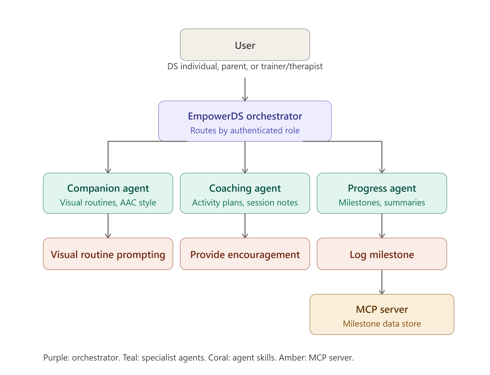

# EmpowerDS

A multi-agent concierge system that supports individuals with Down Syndrome, their parents, and their trainers/therapists through daily routines, encouragement, and progress tracking — built with Google's Agent Development Kit (ADK).

Submitted to the **AI Agents: Intensive Vibe Coding Capstone Project** (Kaggle x Google), **Concierge Agents** track.

## Problem

Supporting someone with Down Syndrome well takes three different kinds of help at once:

- The **individual** benefits from simple, visual, predictable daily routines — brushing teeth, getting dressed, going to school — presented in a format that's easy to follow independently.
- **Parents** need a clear, low-friction way to see how their child is progressing against developmental milestones, without manually tracking everything themselves.
- **Trainers and therapists** need to plan activities and record session notes efficiently, often across multiple clients.

These are three distinct jobs with three different audiences, vocabularies, and outputs. A single generic chatbot tends to either over-simplify for parents and professionals, or overwhelm the individual it's meant to support. EmpowerDS solves this by giving each audience its own specialist agent, behind one front door.

## Solution

EmpowerDS is an **orchestrator + specialist** multi-agent system. A single entry point identifies who's asking (the individual, a parent, or a trainer/therapist) and hands the conversation to the agent built specifically for that role:

- **Companion agent** — supports the individual directly, using visual routine cards and AAC-style (simple, literal) language.
- **Coaching agent** — supports trainers/therapists with activity plans and session notes.
- **Progress agent** — supports parents with milestone tracking and clear summaries.

Each specialist is backed by its own **agent skill** (a `SKILL.md`-defined capability), and the progress agent is additionally backed by a working **MCP server** that stores and retrieves real milestone data.

## Architecture



A request flows from the user, through the orchestrator, to the right specialist, and (for progress tracking) on to a small MCP-backed data layer:

1. The user sends a message, ideally identifying their role (individual, parent, or trainer/therapist).
2. The **EmpowerDS orchestrator** (a ReAct-style ADK agent communicating over the A2A protocol) reads the role and routes the request. If the role isn't yet known, it asks for clarification before proceeding — it never lets one agent silently do another's job.
3. The orchestrator calls the matching specialist as a real sub-agent (via ADK's `AgentTool`), not a placeholder — the specialist's actual generated response is what the user sees.
4. The **progress agent**'s `log-milestone` skill talks to a dedicated **MCP server**, which reads and writes milestone data (`progress_analyst/data/user_milestones.json`, benchmarked against `ds_benchmarks.json`).

### Key concepts demonstrated

| Concept | Where |
|---|---|
| Multi-agent system (ADK) | `app/agent.py` — orchestrator with three real sub-agents wired via `AgentTool` |
| MCP Server | `progress_analyst/mcp_server.py` — backs the progress agent's milestone tracking |
| Agent skills | `SKILL.md` files in each specialist: `visual-routine-prompting`, `provide-encouragement`, `log-milestone` |

### Project structure

```
orchestrator/
├── app/                        # Orchestrator agent code
│   ├── agent.py                 # Root orchestrator + sub-agent wiring
│   ├── agent_runtime_app.py     # Agent Runtime / A2A application logic
│   └── app_utils/               # Telemetry and shared helpers
├── companion-agent (defined in app/agent.py)
├── coaching_specialist/         # Trainer/therapist specialist
│   └── provide-encouragement/   # Skill: activity plans + encouragement
├── progress_analyst/            # Parent-facing specialist
│   ├── mcp_server.py            # MCP server backing milestone tracking
│   ├── data/                    # Milestone + benchmark data
│   └── log-milestone/           # Skill: milestone logging
├── routine_specialist/          # DS-individual-facing specialist
│   └── visual-routine-prompting/ # Skill: visual routine card formatting
├── deployment/                  # Terraform infra for Google Cloud
└── tests/                       # Unit, integration, and load tests
```

---

## Developer setup

> 💡 **Tip:** Use [Gemini CLI](https://github.com/google-gemini/gemini-cli) for AI-assisted development — project context is pre-configured in `GEMINI.md`.

### Requirements

Before you begin, ensure you have:
- **uv**: Python package manager (used for all dependency management in this project) - [Install](https://docs.astral.sh/uv/getting-started/installation/) ([add packages](https://docs.astral.sh/uv/concepts/dependencies/) with `uv add <package>`)
- **agents-cli**: Agents CLI - Install with `uv tool install google-agents-cli`
- **Google Cloud SDK**: For GCP services - [Install](https://cloud.google.com/sdk/docs/install)
- **Terraform**: For infrastructure deployment - [Install](https://developer.hashicorp.com/terraform/downloads)

### Quick start

Install `agents-cli` and its skills if not already installed:

```bash
uvx google-agents-cli setup
```

Install required packages:

```bash
agents-cli install
```

Authenticate with Google Cloud (required for Vertex AI calls):

```bash
gcloud auth application-default login
gcloud config set project <your-project-id>
gcloud services enable aiplatform.googleapis.com --project=<your-project-id>
```

> Vertex AI requires a billing account linked to your project, even for free-tier usage. Link one at `https://console.developers.google.com/billing/enable?project=<your-project-id>` if you haven't already.

Test the agent with a local web server:

```bash
agents-cli playground
```

Run the test suite:

```bash
uv run pytest tests/unit tests/integration
```

You can also use features from the [ADK](https://adk.dev/) CLI with `uv run adk`.

### Commands

| Command              | Description                                                                                 |
| -------------------- | ------------------------------------------------------------------------------------------- |
| `agents-cli install` | Install dependencies using uv                                                         |
| `agents-cli playground` | Launch local development environment                                                  |
| `agents-cli lint`    | Run code quality checks                                                               |
| `agents-cli eval`    | Evaluate agent behavior (generate, grade, analyze, and more — see `agents-cli eval --help`) |
| `uv run pytest tests/unit tests/integration` | Run unit and integration tests                                                        |
| `agents-cli deploy`  | Deploy agent to Agent Runtime                                                                |
| `agents-cli publish gemini-enterprise` | Register deployed agent to Gemini Enterprise                    |
| [A2A Inspector](https://github.com/a2aproject/a2a-inspector) | Launch A2A Protocol Inspector                                                        |
| `agents-cli infra single-project` | Set up single-project infrastructure using Terraform                              |

### Project management

| Command | What It Does |
|---------|--------------|
| `agents-cli infra cicd` | One-command setup of entire CI/CD pipeline + infrastructure |
| `agents-cli scaffold upgrade` | Auto-upgrade to latest version while preserving customizations |

### Development

Edit your agent logic in `app/agent.py` and test with `agents-cli playground` - it auto-reloads on save.

### Deployment

```bash
gcloud config set project <your-project-id>
agents-cli deploy
```
To set up your production infrastructure, run `agents-cli infra cicd`.

### Observability

Built-in telemetry exports to Cloud Trace, BigQuery, and Cloud Logging.

### A2A Inspector

This agent supports the [A2A Protocol](https://a2a-protocol.org/). Use the [A2A Inspector](https://github.com/a2aproject/a2a-inspector) to test interoperability.
See the [A2A Inspector docs](https://github.com/a2aproject/a2a-inspector) for details.